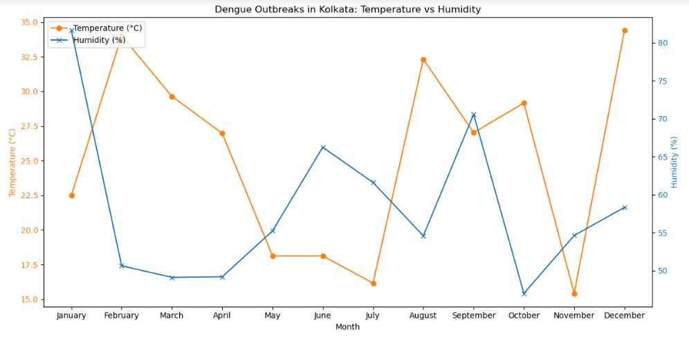

# Project6-EDA-Dengue-Outbreaks-Kolkata-Analyzed
> **Brief Description:** - Dengue outbreaks in Kolkata analyzed based on temperature and humidity during different months of the year.

---

## Table of Contents

- [Description](#description)
- [Video Explanation](#video)
- [Technologies Used](#technologies-used)
- [Dataset](#dataset)
- [Program Codes ](#program-codes)
- [Screenshots](#screenshots)
- [Contribution](#contributipn)
- [Contact Details](#contact-details)

---

## Description

Dengue outbreaks in Kolkata analyzed based on temperature and humidity during different months of the year. The plotting in this case has been done as comparable line chart with different colors.

## Video
<!--
 
-->

We are working on this section. Please check at some other time.

## Technologies-used

Python programming language, pandas, folium, IPython and geopandas package.

## Dataset

The dataset has been generated by another program. However, it is recommended that for real life analysis actual data should be collected and processed properly to get realistic results.

## Program-codes

The programs are written on jupiter notebook, You may run the program on Google colab by clicking on the colab badge below. However, the output may not be generated on colab. For that you have to download the program and run it locally. Make sure that the packages are all installed.

## Screenshots

**This program generates a dual-axis line plot to visualize the relationship between temperature, humidity, and dengue outbreaks in Kolkata over a period of months. Here's what we can conclude from its output:**

- **Temperature and Humidity Trends:**

  - The plot shows how temperature (°C) and humidity (%) change over the months. Temperature is plotted on the primary y-axis (left), and humidity is plotted on the secondary y-axis (right).

- **Seasonal Variations:**

  - By examining the trends, one can observe seasonal variations in temperature and humidity. For example, there may be months with higher temperatures and lower humidity or vice versa.

- **Correlation Insight:**

  - The plot allows for visual correlation between temperature and humidity. For instance, if there are months where both temperature and humidity are high, it can be inferred from the plot.

- **Impact on Dengue Outbreaks:**

  - Although the plot does not directly show the number of dengue cases, it sets the stage for understanding the environmental conditions (temperature and humidity) that might influence dengue outbreaks. Typically, higher temperatures and humidity levels can create favorable conditions for mosquito breeding, thereby increasing the risk of dengue.

- **Critical Months:**

  - By identifying months with extreme temperatures or humidity levels, one can pinpoint critical periods that may require more focused public health interventions to control dengue outbreaks.

In summary, this plot helps visualize the monthly changes in temperature and humidity in Kolkata and provides insights into how these environmental factors might correlate with dengue outbreaks. This understanding can be crucial for planning effective dengue prevention and control strategies.

## Contribution

The programs are written by Santanu Karmakar

## Contact-details

If you wish to contact me, please leave a message (Preferably WhatsApp) on this number: 6291 894 897.
Please also mention why you are contacting me. Include your name and necessary details.
Thank you for taking an interest.
